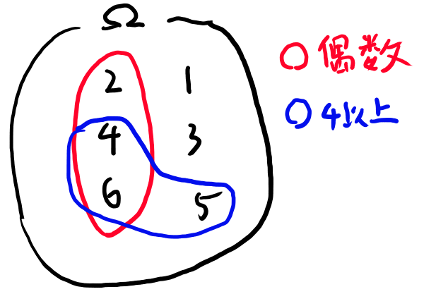
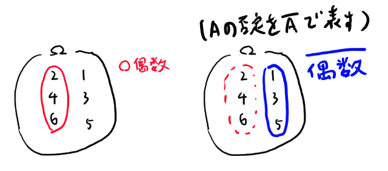
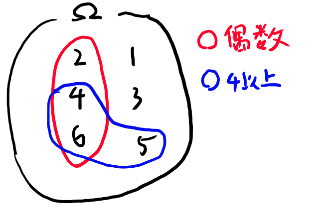
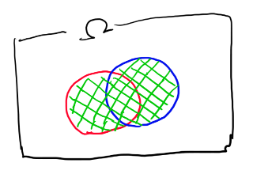
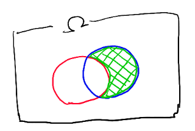
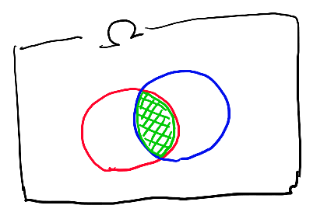

# シグマ集合族ってなんなのさ

測度論の入門的な確率空間ではシグマ集合族が重要な位置を占めます。
そして機械学習とか実解析ではボレル集合族が重要な位置を占めるようになります。

このシリーズとしては本題では無いのだけど、やはりこの辺の事は知っておく必要があるので、この章ではこの2つにまつわる話をしていきたい。

ボレル集合族でググると測度論で苦しむ若者たちのメモのような物をたくさん読む事が出来ます。
ここでさらにもう一つ似たようなメモを増やすよりは、
このシリーズではもっといい加減な雑談をしていきたい。

感覚的な話とか位相との関係とかを雑に話していきます。

### シグマ集合族とボレル集合族の定義から

厳密な定義としては

[ルベーグ積分から確率論 (共立講座 21世紀の数学) https://www.amazon.co.jp/dp/4320015622/](https://www.amazon.co.jp/dp/4320015622/)

のp15あたりからを見てもらうとして、ここでは雑な話を。

シグマ集合族とは、大雑把には

- その要素のnot
- その要素のintersection

もまたシグマ集合族に属すような集合族の事です。

無限回のintersectionも許す所が理論的に難しい所だけど、
感覚的にはある部分集合の、否定をとってもintersectionをとってもその集合族に属す、と思っておけば機械学習的には十分。

で、ボレル集合族は開集合を含む最小のシグマ集合族の事、と定義される。
現実的には離散的な集合の話をする時はシグマ集合族、$$\mathbb{R}$$の上の話をする時はボレル集合族、と思っておけばだいたいOK。

| 対象となる集合 | 事象族として選ばれる集合族 |
| ---- | ---- |
|離散集合 $$\Omega$$ | シグマ集合族 |
| $$\mathbb{R}$$ | ボレル集合族 |

ボレル集合族は実数上の自然なシグマ集合族として重要で、これは確率変数が実数への可測関数として定義される事から、確率変数中心の定式化ではボレル集合族が主役となります。

機械学習屋としては、定義よりも、それが自分が今取り組んでる実際の問題の、
何に対応しているかを知る事が大切です。
という事で具体的には何か、という話をしていきたい。

### まずは大雑把に、サイコロの例でシグマ集合族と確率測度を考える

サイコロを一回振った時の、偶数の目が出る、という事象と、4以上の目が出る、という事象について考えよう。

図示すると以下のようになる。

この時、シグマ集合族というのは赤とか青の丸で書いた物だ。

厳密に言えば赤い丸が一つの要素、青い丸がもうひとつの要素となる。
文字としてはFで表されるものだ。
で、このいろいろなFを全部集めた物が $$\mathscr{F}$$ となる。

つまり以下のような式の話をしている。

$$F \in \mathscr{F}$$

さて、一つのFとしては、例えば偶数の目、というのは、

$$ \{2, 4, 6\} $$

という集合を表す。これはいつも$$\Omega$$の部分集合だ。

測度というのはこのBの大きさを表す物だ。
確率測度は$$\Omega$$全体を測ると1になる物、という決まりがあるが、
確率測度じゃないただの測度ならその辺には特に決まりが無い。

だから絶対的な大きさにはあまり意味が無くて、相対的な大きさにしか意味が無い。

具体的に考えよう。普通確率じゃない測度は$$\mu$$で表す事が多い気がするので、
ここでもそうしよう。

今回は要素の数を測度としよう。

つまり、

$$ \mu (偶数の目) = \mu (\{2, 4, 6\}) = 3$$

となる。

機械学習屋としては、測度が大きさを測る関数で、$$\mathscr{B}$$ がその大きさを測る対象だ、という事をしっかり覚えておく事が大切。

## シグマ集合族の定義の、それぞれの意味を考える

さて、シグマ集合族の定義とは、だいたい任意のFの否定も$$\mathscr{F}$$の要素で、
しかも、intersectionも$$\mathscr{F}$$に入る、というのがおおまかな物だ、と言った。

という事で、それぞれの定義の意味を実例を元に考えてみよう。

### 否定が含まれるとは

Fの否定もまた$$\mathscr{F}$$に含まれる、という事の意味を、先程のサイコロの例で考えてみよう。

まず、偶数の目、という部分集合を考える。その否定というのは以下になる。

つまり $$\{2, 4, 6\} \in \mathscr{B}$$なら、$$\{1, 3, 5\} \in \mathscr{B}$$でも無くてはいけない、という事だ。

なんでこれが大切かといえば、確率というと

$$ P(A) = 1 - P(\bar{A}) $$

とか、そういう関係式が成り立って欲しい訳だが、この時右辺がいつも成立する為には、
右辺も大きさを測る対象である必要がある。つまり、$$\mathscr{B}$$の中に入っていないと困る、という事だ。

### intersectが含まれる事

サイコロを一回振った時の、偶数の目が出る、という事象と、4以上の目が出る、という事象について考えよう。

図示すると以下のようになる。

$$ \{ 偶数の目 \cap 4以上の目 \} \in \mathscr{B} $$

とは、この場合は

$$ \{ 4, 6 \} \in \mathscr{B} $$

という意味となる。
このintersectがまた $$ \mathscr{B} $$ に入る、というのは、
先程の否定が入る事と合わせると、良くあるような確率の対象を表す事が出来る訳です。

例えば以下の緑の網掛けみたいな感じのが表現出来ます。

逆にこういう良くあるようなパターンも確率測度の対象となるような物を全部集めた物、
それがシグマ集合族、と思っておいて実用上はOKです。

### シグマ集合族と確率測度

測度というのは、雑な言い方をすれば集合の大きさだ。
その集合がどのくらいの範囲を占めているのか、という、集合の大きさを表す。

確率測度は、測度のうち全集合が1になるような測度の事だ。

で、シグマ集合族のnotとintersectionが自身に含まれる、というのは、確率の基本的な公式を満たすのに必要となる。

例えばある事象AとBがあった時に、

$$ P(A \cup B) = P(A) + P(B) - P(A \cap B) $$

というような確率論の基本的な公式を議論する為には、$$A \cup B$$とか$$A \cap B$$が事象、つまりPの定義域である必要がある。

これらが全てPの定義域として閉じてますよ、という要請を追加した開集合のような物がシグマ集合族だ。

そして測度の定義も上のような類の式が成り立つような何か、という事になる。
感覚的にはやはり部分集合の大きさを測る物で、分解したら個々の要素の和が全体の和と等しくなる、みたいな感じの性質の物と思っておけば良い。

### 事象族とシグマ集合族

確率空間を構成する3つの文字の一つ、事象族について。

厳密な定義はおいといて、事象族というのがどんな物なのかイメージしておくのは大切だ。
特にこれが標本空間の部分集合の集まり、という事はちゃんと理解しておかないと、
論文が読めない。

事象というのは、確率測度で大きさが図れる物、という事だ。
確率測度は部分集合の大きさを測るもので、
もっといえば全集合との大きさの比率を測ることになる（確率測度は定義により全体の測度が1なので）。

これはつまりPの定義域になる、

Pは集合の大きさを測る物だったので、事象も集合、正確には部分集合となる。
Pが対象とするような部分集合を全部集めた物、それが$$\mathscr{F}$$。

それらから好きに要素、A, Bを取り出したら、$$A \cup B$$とか$$\bar{A}$$とか$$A \cap B$$とかも$$\mathscr{F}$$に含まれる、という事が保証されているだけ。

具体例としては、「サイコロの目が偶数」と「サイコロの目が4以上」という2つの事象があった時に、
このnotとかintersectionも事象、つまり$$\mathscr{F}$$の要素となる。

### TODO: 続きはあとで書く

- 可測関数の話
- 開集合とシグマ集合族の比較
- 連続関数と可測関数の比較

