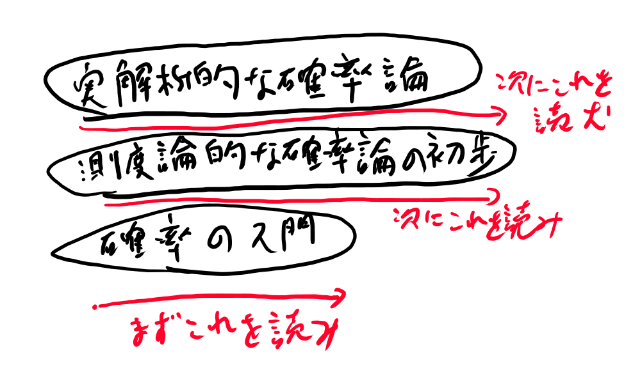

### この話を書こうと思ったきっかけ

世の中には機械学習に必要な数学の入門の話が溢れかえってる気がする。
最低限必要な数学はこれですよ、みたいな。

でも、入門より先の話をする人が全然居ない気がする。
測度論、とか言葉は出すけれど、その中身を語る人を見かけた事が無い。
皆が話題にしている流行りの論文には結構難しい数学を前提としているのに、
その前提の話をしている人はどこにも居ないように見える。

自分としては、最低限必要な話では無く、このくらいあれば十分、という方を知りたい。
誰かに書いて欲しい気はするが、まずは自分が知る範囲で書いてみよう、と思った。

### 自分の知ってる範囲を書く

本当に書きたい事は、「機械学習に十分な確率はここまでです」という事を書きたいのだけれど、残念な事に私がそこまでは理解していない。

そもそもに十分、というのは個人差がある所で、
例えば関数解析に詳しい人は関数解析的な議論を深める事で業界に貢献出来るし、
幾何学に詳しい人は幾何学的な議論を深める事で、
実解析に詳しい人は実解析的な議論を深める事で業界に貢献しているように見える。

そういう点からすると、皆が知らないような事を知っていると、
それは武器になるという物であって、要らないという気はあまりしない。
だから十分、というのは、最低限必要よりも定義が難しい。

そこで、自分が流行の論文を理解しようとした時に勉強した範囲を書いていこうと思う。
ただ勉強した事を書くのでは無く、
この論文のここを理解しようとしたらこれが必要と言われたのでこれを学んだ、
というように、どこの論文から始まった話かを明確にしていきたい。

一応自分はプログラマとして機械学習に関わっている人間としては、
標準的な程度の確率論の理解はあると思っている。
しかも仕事でもそれを実際に使っているので、
実務で実際に仕事をする場合の一サンプルにはなっているんじゃないか。

### 書く形式

確率論のトピックを幾つか、5個か6個くらい選んで書いていく。
例えば確率変数、とか。

確率変数とは何か、という事は、学ぶ数学の段階で定義が違うと思う。

- 入門的、古典的な確率論
- 測度論的な確率論の初歩
- 実解析的な確率論

これらは普通、別々の教科書になっていて、普通は順番に読んでいく必要がある。
だから確率変数とは何かという事などを知りたいと思っても、
それ以外の項目についての一段下の教科書を全部読んでおかないと、
次に進めない、という事になっている気がする。

これをトピックごとに、縦につなげる側で話してみたい。

縦に話をする事で、それぞれの分野がどう違うのか、というのが、
そんなに長い修行期間を経なくても分かるように出来るんじゃないか。

そしてそれらの違いから、
どうして機械学習では実解析的な扱いや関数解析的な扱いが必要になりがちなのか、
また逆に、それらを知らないで一段下のレベルの数学の理解でもどの位までは分かりそうか、みたいな話が出来たらなぁ、と思っている。

### 確率論の雑談を書いていきたい

数学の教科書を書きたい訳でも書く能力がある訳でも無いので、
数学的な定義とかそういう話はあまり頑張っては書いていくつもりはありません。

個々の定義よりは、それらの定義と他の物との関係とか、機械学習ではどうやって出てくるかとか、
どこが分かりにくいのかとか、どこが難しいのかとか、どこが自分には分からないのかとか、
そういう雑談をしていきたい。

数学読み物みたいな感じで。

ただなるべくちゃんとした記述へのポインタは示していきたいと思っている。
だいたいは教科書のページ数とかへの参照となる予定。

