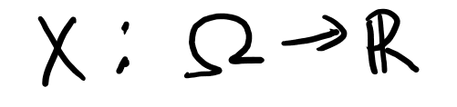
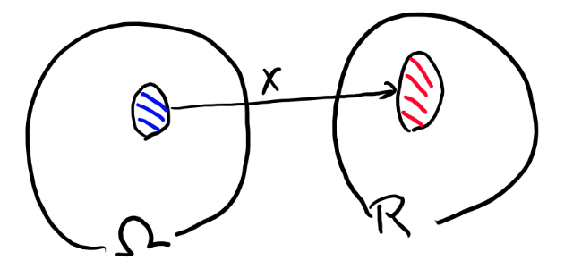

# 確率空間

最初に測度とかボレル集合族とか可測とかの話をしておきたいので、
確率空間について話す所から始めます。

確率空間は私の知る限り、

1. 古典的な確率空間の定義
2. 測度論の入門的な確率空間の定義
3. 確率変数とlawによる定義（主に実解析でよく使う）
4. 分布による定義（主に関数解析でよく使う）

の4つの定義がある。

そして機械学習では3の定義が多くて論文でもだいたい3の定式化を使っていると思う。
たまに2の定義もある。

機械学習ではよく使われる3の定義だが、これは測度論の本ではあまり扱われてない事がある（特に入門書の場合）。
自分は最初、3を中心とした定式化で議論するというやり方を知らずにずいぶん混乱した。
これは測度論までやっておけば機械学習は十分、
という神話が広まってしまっている副作用に思う。

という事で、ここでは3や4の話をもっとしていきたい。

## 古典的な定義

普通、標本空間と事象と確率の話からぼんやりと確率空間の話をするのが古典的な確率論の入門書の始まりなのだが、これがなんだか良く分からない。
というのはシグマ集合族と確率測度を出さずに、その話をしようとするからだ。

ここでは簡単に古典的な定義の話をして、それが全然わからん、という事から話を初めたい。

普通確率空間とは、$$(\Omega, \mathscr{F}, P)$$の3つの構成要素からなる空間を言う。
で、この3つは古典的には標本空間、事象、そしてPと呼ばれる。

Pには、古典的な世界ではたぶん名前が無いけれど、測度論的な用語で言えば確率測度の事。

### 標本空間

まず、サイコロを一つ振る、という事を考える。
この時、標本空間とは出る可能性がある全てのサイコロの目の事です。
この場合は

$$\{1, 2, 3, 4, 5, 6\}$$

となります。普通$$\Omega$$で表すので、

$$\Omega = \{1, 2, 3, 4, 5, 6\}$$

と書いておきましょう。

イメージとしては、確率的出来事のとりうる、全要素の事です。
この標本空間からなにか一つの要素を取り出す事が、確率的な試行に対応します。

これは別段わからない事は無い。

### 事象族

さて、良くわからなくなるのが事象族です。これは本質的にはシグマ集合族の事なのに、
入門書ではそれを持ち出さないでぼんやりと定義される。

事象というのは、確率を求めたい、標本空間の何らかの部分集合の事と言われる。
なんじゃそりゃ。

で、そのあとに具体例が出てくる。例えば「偶数の目が出る」などが事象の例です、
とか言ってくる。

事象は、標本空間の部分集合なので、集合です。
例えば「偶数の目が出る」の場合は、

$$\{2, 4, 6\}$$

となります。この3つの要素を持った集合。

で、この事象を全部集めた物を事象族といいます。
事象が集合なので、その事象を集めた物は、集合の集合という事になります。
集合の集合は集合族と呼ばれるから、事象族と呼びます。

事象族の表記としては花文字Bとか花文字Fとかで書く。
FはF集合族から来ているのか？Bはボレル集合族ですかね。
シグマ集合族の場合はFを使う場合が多い気がする。古典的な場合はeventという事からかEを使う場合もある。

花文字というのは下みたいな文字の事です。

$$\mathscr{F}$$

で、その事象族の要素となる事象は、普通の大文字で書く。この場合はF。

$$F \in \mathscr{F}$$

なお、集合体も集合族と同じ意味。
シグマ集合族はシグマ集合体と言っても良い。
体をなしているかどうか、とか細かい話はあるかもしれないが、このシリーズでは細かい事は気にしない。

花文字、手描きでうまく書けないからやめて欲しいのだけれど、業界の習慣なので仕方ない。

### 確率P

古典的にはなんて呼ぶのか良く知らないけれど、事象を引数として、その事象が起こる確率を返す関数をPと呼ぶ。

確率測度の事なんだけど、測度が無い状態ではぼやっと定義される。
そもそも定義もごまかしなので、それを正しくはなんと呼ばれるかとか全然興味湧かない。なので調べない。どうせこの辺はいい加減な誤魔化しなので、細かい事はどうでもいいんです。

だけど、このPは割と具体的なので、厳密な定義は入門書では謎でも、感覚的には何なのかはわかりやすい。
だから入門者が入門書を読んでいる段階でも、あまり苦労は無いはず。

例えば、

$$P(偶数の目) = \frac{1}{2}$$

とか、そういうものだ。
こういう風に、事象Fを引数として、その確率を返す関数の事をPと呼ぶ。

ただそもそも事象とは何かとかぼやっとしてるので、
その対象に対する関数も古典的な世界ではあんまり細かくは議論出来ない。
だからぼやっとそういうもんだ、とわかれば、このレベルでは十分と言える。

入門書は、確率測度を元とした定式化を分かっている人が、それを古典的な言葉に翻訳して書いてある。
でも、測度の定義とかを出さないので、結局測度論を分かっている人だけが分かる自己満足な記述になってしまいがち。
そんな物に、分かるはずの無い入門者は苦労する事になる。
酷い話だ。

という事でこの辺わからない人は、あんまりわからないと深く考えず、とっとと測度論に行くのがオススメです。

### 古典的な確率空間

さて、さっぱり定義出来ていない物を合わせて定義もクソも無いのだが、
これら3つを合わせて確率空間と呼ぶ。

$$(\Omega, \mathscr{F}, P)$$

3つなのでトリプレットとか言ったりもする。

ちゃんと定義は出来てないから理解は出来てなくて当然だが、それぞれ何を指しているかをちゃんと識別出来ておく必要はある。

| 記号 | 意味 |
| ---- | ---- |
| $$\Omega$$ |  標本空間、$$\{1, 2, 3, 4, 5, 6\}$$ の事 |
| $$\mathscr{F}$$ |  事象族、 $$\{\{偶数の目\}, \{4以上の目\}, \{2, 3, 5\} など\}$$ 標本空間の部分集合の集まり。 |
| $$P$$ | 呼び方は知らないけど、事象を引数にその事象が起こる確率を返す関数 |

### 古典的な確率空間でだいたいすべてを説明出来る

古典的なこれらの定義が何を指しているかをちゃんと理解しておけば、
機械学習に出てくる理論的な事は、原理的には全部説明出来ると思う。
機械学習の話をするには、本当は測度論とかは一切要らない。

ただ、誰も古典的な言葉で説明なんてしてくれないので、
一人分働くには測度論とかが要るのだ。
誰か流行りの論文を全部古典的な言葉に翻訳してくれればいいのにねぇ。

この、「アイデアを伝達する為に皆が使っているから実務家もここから先の数学が必要」
というのが、ほとんどの実務家にとっての数学の現実だと思う。

だから逆に言うと、変な性質を持ったゼロ測度の集合の時の振る舞いとか、
ジャンプする関数の片側極限の話とか、
そういう理論的に際どいところの証明とかは、実務家視点では要らない。
説明をする為の言葉とか、証明の為のパターンとか、そういうのだけが必要、と自分は思います（異論歓迎です）。

だから機械学習屋で、自分が理論系論文を書く訳では無い大多数の人は、
この説明に使われる、「言葉としての実解析」をどうやって学んでいくか、
という事を考える必要があると思うし、
「難しい事は全部飲み込む、言葉としての実解析を学ぶ本」とかあったらすごい良いと思う。
誰か書いて。

## 入門的な測度論的確率空間

古典的な話なんかしたくてこの文書を書いているのでは無いのです。
という事で次の測度論的な定義に進みます。古典的な確率空間の次は「入門的な測度論的確率空間」。

2012年とかその辺の時代なら、このセクションのタイトルに「入門的な」は要らなかったと思う。
「測度論的な確率空間を理解すれば機械学習に必要な確率論は全て理解出来たと言って良い（キリッ」  とか言えた。

で、分かってない人も、難しい数学の話は「測度論」という単語を出してイキっておけば分かってるフリが出来ている、という事になっていた。

平和な時代だった…

もちろん今は測度論的な確率空間の初歩を知っている程度では流行りの論文などさっぱり何を言っているか理解出来ないのだが、
それでも一応この辺の事を知っている人なら、さわり位は分かるように書くのがマナーとなっている気がする。
だから2018年現在でも入門的な測度論的確率空間をちゃんと知っている意味はある。

という事で2018年現在ではもはや「入門的な」とつけなくてはいけない測度論的な確率空間の話を簡単にしてみよう。

といっても、そもそもに古典的な確率空間はこの測度論的な確率空間を誤魔化して説明しているだけなので、だいたい同じ物である。
測度論的な確率空間も以下の3つの要素からなる。

$$(\Omega, \mathscr{F}, P)$$

このうち、標本空間は古典的な物も測度論的な物も変わらない。

違うのは事象族とPだ。

事象族はシグマ集合族であり、Pは確率測度となる。
このシグマ集合族と測度は、このシリーズで重要なので、
「[シグマとボレル集合族と測度](borel.md)」の章で扱う。

ちょっと前後するが、一旦そちらを読んでから続きを読んでほしい。

### シグマ集合族

確率空間を構成する3つの文字の一つ、シグマ集合族について。

厳密な定義はおいといて、シグマ集合族が指している物がどんな物なのかイメージしておくのは大切です。
特にこれが標本空間の部分集合の集まり、という事はちゃんと理解しておかないと、
論文が読めない。

シグマ集合族が指しているのは、古典的な例の事象族、と言っていた物です。

事象族はサイコロの目の例なら「サイコロの目が偶数」といか、「サイコロの目が4以上」とかそういう物でした。
書き方はいろいろだけど、最終的には必ず$$\Omega$$の部分集合で表せる。

シグマ集合族は、ある数学の性質を持った厳密に定義されている集合族の事だけど、
機械学習の実務家的には数学の性質はそんなに重要じゃない。

事象族をちゃんと定式化するとシグマ集合族の性質を持ってないとまずいらしくて、
だからその性質が要請されるだけで、
事象族の事を指していると思っておいて良い。
詳細はシグマ集合族の章を見てください。

まぁ開集合みたいなもんですよ。

### 確率測度

測度というものについてはシグマ集合族と測度の章で扱うのだけど、
簡単に話をしておく。

測度はシグマ集合族の要素（つまり標本空間の部分集合）の大きさを測る関数です。
絶対的な大きさはどうでも良くて相対的な大小だけが重要。

だから例えば、サイコロの目の数、というのは立派な測度になります。
普通一般の測度はPじゃなくて$$\mu$$で書くのでそれに習うと、

- $$ \mu(\{1, 2, 3, 4, 5, 6\}) = 6$$
- $$ \mu(\{偶数の目\}) = \mu(\{2, 4, 6\}) = 3$$
- $$ \mu(\{4以上の目\}) = 3$$

こんな感じで要素の数を数えるような物が測度です。

ただ連続な場合は数えるというとよくわからないですが、だいたいは連続空間の中で要素が広がっている長さで良い。
二次元なら面積で良い。
実際そんなような測度には、ルベーグ＝スティルチェス測度という名前もついている。

で、測度と確率測度の違いは、1で規格化されてる、というだけ。
全集合の測度が1になるような測度、それが確率測度です。

とにかく、部分集合の大きさみたいなのを測る関数、というイメージを持っておくのが大切。

## 確率変数による確率空間の定義

さて、入門的な測度論的な確率空間は、昨今ではDeep Learning系の論文ではほとんど使われていない。
最近はトリプレットの最後は確率測度では無くて、Random Variable、つまり確率変数で定義されています。

ここからがこの文書の本題。

確率変数はまた数学のレベルに応じて何段階か定義があるところなので独立した章で扱います（予定）。
可測関数と何かについては確率変数の章で詳細を説明する事にしますが、ここでも簡単に説明しておきます。

まず、確率変数の大雑把な定義から。
Xが確率変数であるとは、

1. 標本空間からRへの関数
2. 可測関数

な物です。

まず1から、以下のように書けます。

で、これが可測関数であるとは、「R上でのボレル集合族の元のXによる逆像が、$$\Omega$$上でのボレル集合族の元となっている」関数の事です。

ややこしいですね。もう少し説明します。

まず、逆像というのを考える為には、Xで特定の範囲が写されているような状況を考えます。
以下みたいな感じ。

この青い範囲の物をXで全部写すと、R上の何かしらの部分集合になる訳です。それを赤で書いてます。

さて、可測関数というのは、先に赤い方を、シグマ集合族の元になるように選びます。
この時、ここにXで来るような$$\Omega$$側を全部集めた物が、$$\Omega$$側でシグマ集合族になっている、という事です。

で、右側のRでのシグマ集合族としては、ボレル集合族が使われます。
ボレル集合族は実数上の自然なシグマ集合族として使われるもので、
だいたい開区間を集めた物です（その拡張だけど）

だから感じとしては、写った先であるR側のシグマ集合族の元を好きに選んでも、
それをXが来る場所に戻すと、もとの方のシグマ集合族に入っている、という事です。

さて、Xは可測関数なので、Rの上のボレル集合族の元、つまり右側の赤いやつには、
必ず$$\Omega$$の方の青いやつが対応します。

なので、青い方に確率測度が定義されていれば、Rの赤いヤツを指定するとそれのもととなる青い奴の測度を一意に求める事が出来ます。

数式で言うと、逆像を$$X^{-1}$$と書くと、

$$P \circ X^{-1}$$

という関数は、R上のボレル集合族の測度となる。

これは測度論の入門書とかだと分布、と呼ばれていて、
機械学習でもあんまり厳密な話をしない人は分布、となんとなく使ってる気がする。
だが、実解析とかの方に行くと分布って累積分布関数の事を指すようになるので、
最初から分布とは言わない方が良いと思う。
分布＝累積分布関数と脳に負荷をかけずに解釈出来るように慣れておかないと、実解析の教科書読む時に本当に辛い思いをする事になるので…

さて、実解析とかでは、これはXのlawと呼ばれたりして、$$\mathscr{L}(X)$$とか書く。
という事でこのシリーズでもlawと呼ぶ事にする。
lawの日本語は知らない。まぁここまで来たらもう日本語はいいでしょう。

呼び方はいいとして、この測度というのは、概念的にはPが使われているのだけど、
一方で実数のボレル集合族上で測度が定義されていれば、それがもともとはPから出来ている、という事なんて知らなくても良い。

実際、lawを一つ決めると、それに対応したPは一意に決まったはず（TODO: あとで厳密な条件を調べる）

そういう訳で、Xとlawを指定する事とPを指定する事は等価なので、
Xとlawを指定する確率空間の定式化が可能となる。
これが機械学習で一番使われている、確率変数による確率空間の定式化だと思う。

## 分布による定義

関数解析的には確率なんて物を持ち出さなくても、かなりの議論が出来る。
この場合、中心になるのはnon-decreaseな関数で、最大値が1のもの、
みたいなすごく一般的な定義で分布と言われる物が最初に決まる。

ジャンプがどういう物が許されるか、とかすごく細かい話が続くのだけど、
基本的にはこのレベルでは確率的な要素は特に無い。

ただ、この分布でかなりの部分の確率論の話が出来てしまう。

確率変数同士の距離とか、距離自身が確率分布する場合を扱おうとするとこちらの定義が主流となる。
だが、自分の知る限り、機械学習ではこちらの定式化が使われる事はあまり無い（私は見た事無い）。

